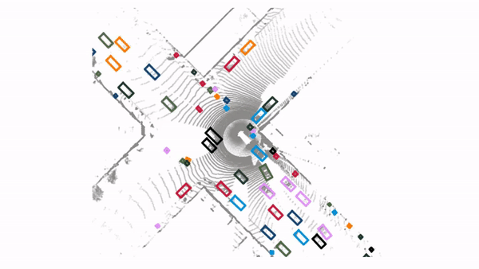
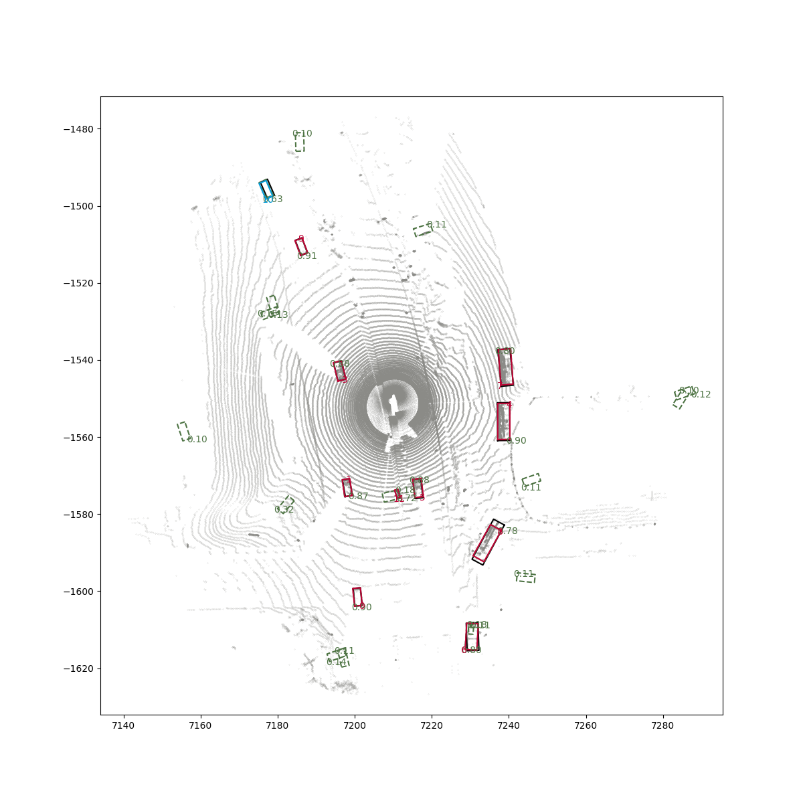

# SimpleTrack: Simple yet Effective 3D Multi-object Tracking

This is the repository for our paper [SimpleTrack: Understanding and Rethinking 3D Multi-object Tracking](https://arxiv.org/abs/2111.09621). We are still working on writing the documentations and cleaning up the code, but the following parts are sufficient for you to replicate the results in our paper. For more variants of the model, we have already moved all of our code onto the `dev` branch, so please feel free to check it out if you really need to delve deep recently. We will try our best to get everything ready as soon as possible.

If you find our paper or code useful for you, please consider cite us by:
```
@article{pang2021simpletrack,
  title={SimpleTrack: Understanding and Rethinking 3D Multi-object Tracking},
  author={Pang, Ziqi and Li, Zhichao and Wang, Naiyan},
  journal={arXiv preprint arXiv:2111.09621},
  year={2021}
}
```



- [ ] Accelerating the code, make the IoU/GIoU computation parallel.
- [ ] Add documentation for codebase.

## Installation

### Environment Requirements

`SimpleTrack` requires `python>=3.6` and the packages of `pip install -r requiremens.txt`. For the experiments on Waymo Open Dataset, please install the devkit following the instructions at [waymo open dataset devkit](https://github.com/waymo-research/waymo-open-dataset).

### Installation

We implement the `SimpleTrack` algorithm as a library `mot_3d`. Please run `pip install -e ./` to install it locally.

## Demo and API Example

### Demo

We provide a demo based on the first sequence with ID `10203656353524179475_7625_000_7645_000` from the validation set of [Waymo Open Dataset](https://waymo.com/open/) and the detection from [CenterPoint](https://github.com/tianweiy/CenterPoint). (We are thankful and hope that we are not violating any terms here.)

First, download the [demo_data](https://drive.google.com/file/d/11tUAV6birmXI6Gk0mQ4DJbqokHlQtMk4/view?usp=sharing) and extract it locally. It contains the necessary information and is already preprocessed according to [our preprocessing programs](./docs/data_preprocess.md). To run the demo, please run the following command. It will provide interactive visualization with `matplotlib.pyplt`. Therefore, it is recommended to run this demo locally.

```bash
python tools/demo.py \
    --name demo \
    --det_name cp \
    --obj_type vehicle \
    --config_path configs/waymo_configs/vc_kf_giou.yaml \
    --data_folder ./demo_data/ \
    --visualize
```

An example output for the visualization is the following figure.



In the visualization, the red bounding boxes are the output tracking results with their IDs. The blue ones are the tracking results that are not output due to low confidence score. The green ones are the detection bounding boxes with scores. The black ones are the ground truth bounding boxes.

### API Example

The most important function is `tracker.frame_mot()`. An object of `MOTModel` iteratively digests the information from each frame `FrameData` and infers the tracking result on each frame.

## Inference on Waymo Open Dataset and nuScenes

Refer to the documentation of [Waymo Open Dataset Inference](./docs/waymo.md) and [nuScenes Inference](./docs/nuScenes.md).

The detailed metrics on Waymo Open Dataset is at, nuScenes is at.

For the metrics on test set, please refer to our paper or the leaderboard.

## Related Documentations

To enable the better usages of our `mot_3d` library, we provide a list useful documentations, and will add more in the future.

* [Read and Use the Configurations](./docs/config.md). We explain how to specify the behaviors of trackers in this documentation, such as two-stage association, the thresholds for association, etc.
* [Format of Output](./docs/output_format.md). We explain the output format for the APIs in `SimpleTrack`, so that you may directly use the functions provided. (in progress)
* Visualization with `mot_3d` (in progress)
* Structure of `mot_3d` (in progress)
